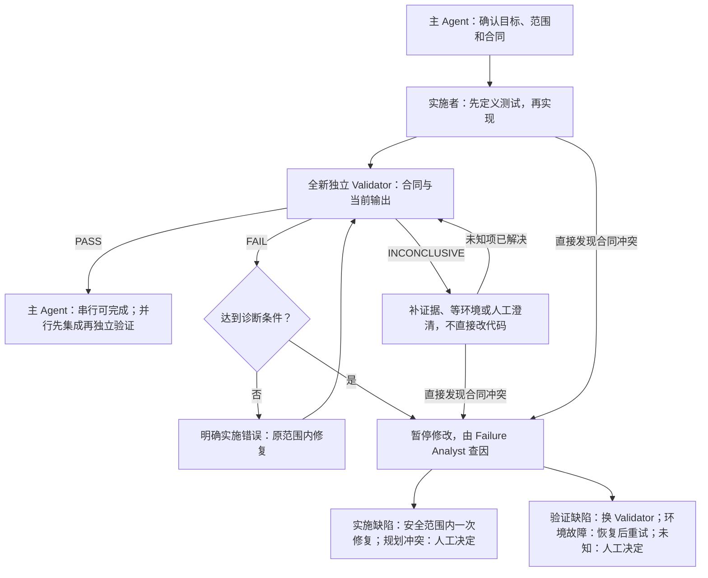

# agentForge

agentForge 是可直接下载使用的静态 Loop Engineering 项目脚手架：用文件保存规则、规划和进度，让 AI 换一个上下文后仍能接着做。它不包含生成器、安装器、初始化脚本、CI、预装 linter 或测试框架。

下载仓库归档并解压即可使用。AI 开始仓库工作时，依据 [AGENTS.md](AGENTS.md) 检查 Git；缺少 Git 和尚未初始化仓库必须分别取得批准才能安装或执行 `git init`。脚手架本身不自动运行这些命令。

## 目录职责

```text
README.md                  # 使用说明
LICENSE                    # MIT 许可证
AGENTS.md                  # 核心纪律、权限和角色入口
CLAUDE.md                  # 引用 AGENTS.md
rules.md                   # 人工批准的项目硬约束
memory.md                  # 稳定偏好、已验证事实和活动计划链接
PLANS.md                   # 长期 Roadmap、依赖和并行批次
CHANGELOG.md               # Unreleased 与正式版本摘要
docs/exec-plans/            # 详细协议、模板和需要持久化的任务状态
├── README.md              # 执行、验证和失败诊断协议
├── template.md            # 必填核心与按需章节
├── active/                # 尚未结束的计划
├── completed/             # 完成或取消的计划及历史
└── tech-debt-tracker.md    # 人工决定如何处理的技术债候选
src/                       # 开发实现；初始仅 .gitkeep
tests/                     # 按功能划分的对应测试；初始仅 .gitkeep
skills/                    # 仅当前仓库使用的工作流
references/                # 用户主动维护的专题知识；初始仅 .gitkeep
```

生产功能默认在 `src/`，对应测试在同级 `tests/<feature-slug>/`。不使用 `product/`，不预设 `dist/`；未来技术栈确实需要构建产物时，按批准范围决定。

## 小任务轻量，大任务留痕

| 工作 | 怎么做 |
| --- | --- |
| 单次只读分析、纯拼写或排版 | 提供依据和适用检查，不强制完整计划或独立验证 |
| 需要跨会话继续的只读分析 | 保存简短目标、证据、检查点和下一动作 |
| 改代码、配置、功能行为或规则含义 | 建立计划、冻结验收合同、实施后独立验证 |
| 多个开发任务并行 | 独立 worktree，任务通过后还要验证集成结果 |

“只改一个字”不等于低影响：命令、链接目标、配置值和约束含义发生变化，都不能按纯排版豁免。拿不准时使用正式流程。模型能力提高，也不取消授权、测试和质量检查。

## 上下文恢复与知识边界

主 Agent 读取规则、记忆、Roadmap 和匹配的活动计划，再用实际仓库状态核对进度。Worker 只接收目标、合同和必要实现范围；Validator 不加载 memory 或计划历史；Failure Analyst 才能为了查因读取相关失败历史。

`PLANS.md` 回答“以后开发什么”，exec plan 回答“当前任务怎么做、做到哪里”，技术债表记录“以后可能需要处理什么”。阶段和任务范围由人工批准；ready batch 就绪时才生成详细计划，同批可同时建立多份，不限制并行。

项目 Skill 使用 `skills/<name>/SKILL.md`，只按触发条件读取，禁止复制、安装或链接到用户级、全局目录或其他仓库。`references/` 保存可复用专题知识，仅在用户主动要求生成或更新时写入，不自动沉淀、填示例或加载整个知识库；它不能代替生效规则和任务状态。

## 冻结验收，而不是冻结测试方法

[AGENTS.md](AGENTS.md) 保留共同纪律，[执行协议](docs/exec-plans/README.md) 定义具体流程，任务专属合同仍在 exec plan 内。

用户明确要求或批准计划，可以同时批准由其直接得到的初始合同；AI 自己猜测的业务要求不能自动冻结。影响范围或验收的未知事项先澄清，范围内的实施方法仍由 AI 选择。

Validator 可以创造新测试，但不能临时加要求。验证同时记录合同版本和受审文件快照；交付内容的含义变化后必须重新验证，不能拿旧 PASS 覆盖新改动。只追加真实记录、状态和归档链接不反复启动验证。

## 开发、验证与失败归因

下面展示正式任务的主流程。串行由主 Agent 或 Worker 实施；独立 Validator 始终不能由实施者自己充当。



| Validator 结论 | 通俗含义 | 接下来 |
| --- | --- | --- |
| PASS | 全部适用标准通过 | 进入适用的完成或集成步骤 |
| FAIL | 标准明确，有证据证明当前结果不满足 | 修复明确实施问题，反复失败则先查因 |
| INCONCLUSIVE | 证据、环境或要求不清，暂时无法判断 | 不直接改实现，先解决未知项 |

同一问题用两种实质不同办法仍修不好、连续三轮修改与验证无收敛，或直接发现要求冲突，会触发失败诊断。Failure Analyst 只找原因，不改文件，不宣布通过；目标冲突由人工批准修订合同，环境故障要有恢复证据才能重试。具体停止和恢复条件见[执行协议](docs/exec-plans/README.md#失败诊断门)。

并行任务必须依赖已满足、写入不冲突、共享接口已冻结。任务级 PASS 只表示各自通过；集成级 PASS 后才能完成回写。串行任务不要求不存在的集成检查。AI 可记录非阻塞技术债候选，但不能自行接受、排序或安排实施。

## 选档与工程检查

Agent 使用 `low / medium / high` 模型能力和推理档位，不绑定厂商。按风险选择最低充分能力，能力不足时使用全新 Agent 直接升级到足够档位，不降低已选维度；没有固定六步路线。合同争议和环境故障不靠升级模型解决，达到停止条件必须暂停。

平台不能控制的维度记为 `platform-default`，不猜测能力；独立性、适用检查和验收不能省略。高风险 Validator 和 Failure Analyst 使用 high/high，具体能力要求见执行协议。

首次引入可执行代码时，在同一任务建立适合实际技术栈的 linter 和测试框架。每项功能先定义正常、错误、边界预期，再实现并交付对应测试，Bug 必须有回归测试；不得为绿灯弱化测试或有效 lint 诊断。静态治理修改不新增功能测试，但运行所有适用检查。

## 发布与许可证

普通变更记入 `CHANGELOG.md` 的 Unreleased；只有用户明确要求发布且批准版本号，才整理正式版本。提交和推送也需要明确授权，成功与否以实际核对为准。

本模板使用 [MIT License](LICENSE)，使用者应根据项目需要审阅。
